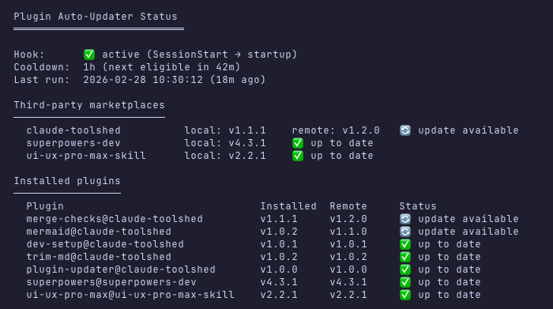

# plugin-updater

Auto-update third-party marketplace plugins on session start.

## Why

Third-party Claude Code marketplace plugins don't auto-update ([issue #26744](https://github.com/anthropics/claude-code/issues/26744)). Plugins from `claude-plugins-official` update automatically, but third-party marketplaces require manual `claude plugin marketplace update` + `claude plugin update` each session. This plugin handles that automatically via a `SessionStart` hook.

## Install

```
/plugin install plugin-updater@claude-toolshed
```

After installing, run `/plugin-updater` once to trigger the first update (works around a [first-run race condition](https://github.com/anthropics/claude-code/issues/10997) where SessionStart hooks from GitHub marketplaces don't fire on the very first session).

## Commands

| Command | Description |
|---------|-------------|
| `/plugin-updater` | Force-update all third-party plugins now (bypasses cooldown) |
| `/plugin-updater status` | Show plugin health dashboard with version comparison |

## How it works

1. A `SessionStart` hook fires on every new session (`startup` event only — not on resume/clear/compact)
2. The hook checks a cooldown timestamp (1 hour) to avoid hammering on rapid restarts
3. Lists all third-party marketplaces (everything except `claude-plugins-official`)
4. Runs `claude plugin marketplace update` for each marketplace in parallel
5. Runs `claude plugin update` for each third-party plugin in parallel
6. Records the update timestamp for cooldown tracking

### Status dashboard

`/plugin-updater status` shows hook state, cooldown, marketplace versions, and per-plugin update availability with a live `git fetch` against remotes.

<p align="center"></p>

## Known limitations

- **First-run race** ([#10997](https://github.com/anthropics/claude-code/issues/10997)): SessionStart hooks from GitHub marketplaces don't fire on the very first session after install. Run `/plugin-updater` manually once after installing.
- **Local file-based marketplaces** ([#11509](https://github.com/anthropics/claude-code/issues/11509)): Hooks from local file-based marketplace plugins never fire. This plugin only works with GitHub-hosted marketplaces.
- **Self-update**: This plugin is itself third-party, so it won't auto-update its own hook script. However, since the hook script is self-contained and stable, this is rarely an issue. Running `claude plugin update plugin-updater@claude-toolshed` updates it.

## When this plugin becomes unnecessary

When [#26744](https://github.com/anthropics/claude-code/issues/26744) is fixed, Claude Code will natively auto-update third-party plugins. At that point this plugin becomes redundant — you can safely uninstall it. The hook is idempotent, so even if both this plugin and native auto-update run simultaneously, nothing breaks (worst case: a harmless double-update).

## Uninstall

Disable the plugin in settings or run:

```
/plugin uninstall plugin-updater@claude-toolshed
```

This removes the SessionStart hook automatically.
